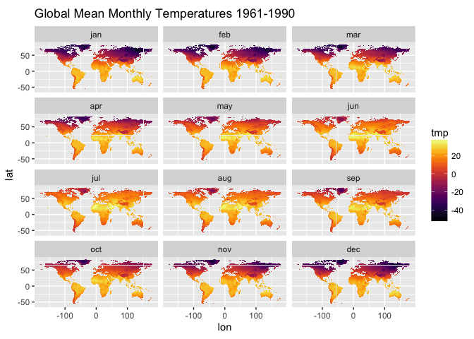
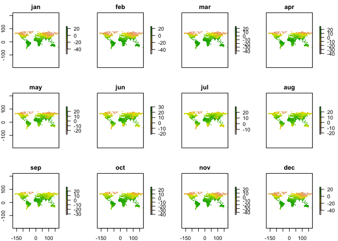
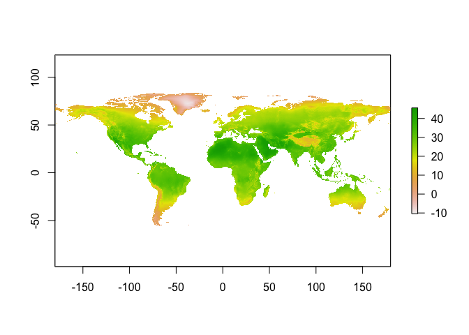

<!-- README.md is generated from README.Rmd. Please edit that file -->
[](https://travis-ci.org/) [](https://ci.appveyor.com/project/ropensci/getCRUCLdata) [](https://codecov.io/gh/ropensci/getCRUCLdata) [](https://cran.r-project.org/package=getCRUCLdata) [](https://github.com/metacran/cranlogs.app) [](https://github.com/metacran/cranlogs.app) [](https://doi.org/10.5281/zenodo.466812) [](http://joss.theoj.org/papers/421837399efdbef2a248d0cf4a6c1d15)

*getCRUCLdata*: Use and Explore CRU CL v. 2.0 Climatology Elements in R
=======================================================================

Author/Maintainer: Adam Sparks

Introduction to *getCRUCLdata*
==============================

The *getCRUCLdata* package provides functions that automate importing CRU CL v. 2.0 climatology data into R, facilitate the calculation of minimum temperature and maximum temperature, and formats the data into a [tidy data frame](http://vita.had.co.nz/papers/tidy-data.html) or a list of [*raster* `stack`](https://CRAN.R-project.org/package=raster) objects for use in an R session.

CRU CL v. 2.0 data are a gridded climatology of 1961-1990 monthly means released in 2002 and cover all land areas (excluding Antarctica) at 10 arcminutes (0.1666667 degree) resolution. For more information see the description of the data provided by the University of East Anglia Climate Research Unit (CRU), <https://crudata.uea.ac.uk/cru/data/hrg/tmc/readme.txt>.

Changes to original CRU CL v. 2.0 data
--------------------------------------

This package automatically converts elevation values from kilometres to metres.

This package crops all spatial outputs to an extent of ymin = -60, ymax = 85, xmin = -180, xmax = 180. Note that the original wind data include land area for parts of Antarctica.

Quick Start
===========

Install
-------

### Stable version

A stable version of *getCRUCLdata* is available from [CRAN](https://cran.r-project.org/package=getCRUCLdata).

``` r
install.packages("getCRUCLdata")
```

### Development version

A development version is available from from GitHub. If you wish to install the development version that may have new features (but also may not work properly), install the [devtools package](https://CRAN.R-project.org/package=devtools), available from CRAN. I strive to keep the master branch on GitHub functional and working properly, although this may not always happen.

``` r
if (!require("devtools")) {
  install.packages("devtools")
}

devtools::install_github("ropensci/getCRUCLdata", build_vignettes = TRUE)
```

Using *getCRUCLdata*
--------------------

### Creating tidy data frames for use in R

The `get_CRU_df()` function automates the download process and creates tidy data frames as a [*tibble*](https://github.com/tidyverse/tibble) of the CRU CL v. 2.0 climatology elements.

``` r
library(getCRUCLdata)

CRU_data <- get_CRU_df(pre = TRUE,
                       pre_cv = TRUE,
                       rd0 = TRUE,
                       tmp = TRUE,
                       dtr = TRUE,
                       reh = TRUE,
                       tmn = TRUE,
                       tmx = TRUE,
                       sunp = TRUE,
                       frs = TRUE,
                       wnd = TRUE,
                       elv = TRUE)
```

Perhaps you only need one or two elements, it is easy to create a tidy data frame of mean temperature only.

``` r
t <- get_CRU_df(tmp = TRUE)
```

#### Plotting data from the tidy dataframe

Now that we have the data, we can plot it easily using [*ggplot2*](http://ggplot2.org) and the fantastic [*viridis*](https://CRAN.R-project.org/package=viridis) package for the colour scale.

``` r
if (!require("ggplot2")) {
  install.packages(ggplot2)
}
if (!require("viridis")) {
  install.packages("viridis")
}

library(ggplot2)
library(viridis)
```

Now that the required packages are installed and loaded, we can generate a figure of temperatures using *ggplot2* to map the 12 months.

``` r
ggplot(data = t, aes(x = lon, y = lat)) +
  geom_raster(aes(fill = tmp)) +
  scale_fill_viridis(option = "inferno") +
  coord_quickmap() +
  ggtitle("Global Mean Monthly Temperatures 1961-1990") +
  facet_wrap(~ month, nrow = 4)
```



We can also generate a violin plot of the same data to visualise how the temperatures change throughout the year.

``` r
ggplot(data = t, aes(x = month, y = tmp)) +
  geom_violin() +
  ylab("Temperature (˚C)") +
  labs(title = "Global Monthly Mean Land Surface Temperatures From 1960-1991",
       subtitle = "Excludes Antarctica")
```


#### Saving the tidy `tibble` as a CSV (comma separated values file) locally

Save the resulting tidy `tibble` to local disk as a comma separated (CSV) file to local disk.

``` r
library(readr)

write_csv(t, path = "~/CRU_tmp.csv")
```

### Creating raster stacks for use in R and saving for use in another GIS

For working with spatial data, *getCRUCLdata* provides a function that create lists of [*raster*](https://CRAN.R-project.org/package=raster) stacks of the data.

The `get_CRU_stack()` functions provide similar functionality to `get_CRU_df()`, but rather than returning a tidy data frame, it returns a list of `raster::stack()` objects for use in an R session.

The `get_CRU_stack()` function automates the download process and creates a `raster::stack()` object of the CRU CL v. 2.0 climatology elements. Illustrated here is creating a `raster::stack()` of all CRU CL v. 2.0 climatology elements available.

``` r
CRU_stack <- get_CRU_stack(pre = TRUE,
                           pre_cv = TRUE,
                           rd0 = TRUE,
                           tmp = TRUE,
                           dtr = TRUE,
                           reh = TRUE,
                           tmn = TRUE,
                           tmx = TRUE,
                           sunp = TRUE,
                           frs = TRUE,
                           wnd = TRUE,
                           elv = TRUE)
```

The `create_CRU_stack()` function works in the same way with only one minor difference. You must supply the location of the files on the local disk (`dsn`) that you wish to import.

``` r
t <- create_CRU_stack(tmp = TRUE, dsn = "~/Downloads")
```

#### Plotting raster stacks of tmin and tmax

Because the stacks are in a `list()`, we need to access each element of the list individually to plot them, that's what the `[[1]]` or `[[2]]` is, the first or second element of the list. Here using `[[1]]` we will plot the monthly average minimum temperature for all twelve months.

``` r
library(raster)

plot(tmn_tmx[[1]])
```



To plot only one month from the stack is also possible. Here we plot maximum temperature for July. Note that we use To plot only one month from the stack is also possible. Here we plot maximum temperature for July. Note that we use indexing `[[2]]` as before but append a `$jul` to the object. This is the name of the layer in the raster stack. So, we are telling R to plot the second object in the `tmn_tmx` list, which is `tmx` and from that `raster::stack()`, plot only the raster layer for July.

``` r
plot(tmn_tmx[[2]]$jul)
```



#### Saving raster objects to local disk

The raster stack objects can be saved to disk as geotiff files (others are available, see help for `writeRaster()` and `writeFormats()` for more options) in the `Data` directory with a tmn or tmx prefix to the month for a file name.

``` r
library(raster)

dir.create(file.path("~/Data"), showWarnings = FALSE)
writeRaster(tmn_tmx$tmn, filename = paste0("~/Data/tmn_", names(tmn_tmx$tmn)), bylayer = TRUE, format = "GTiff")

writeRaster(tmn_tmx$tmx, filename = paste0("~/Data/tmx_", names(tmn_tmx$tmn)), bylayer = TRUE, format = "GTiff")
```

Advanced usage
--------------

### Caching files for later use

When using the `get_CRU_df()` or `get_CRU_stack()` functions, files may be cached in the users' local space for later use (optional) or stored in a temporary directory and deleted when the R session is closed and not saved (this is the default behaviour already illustrated above). Illustrated here, create a tidy data frame of all CRU CL v. 2.0 climatology elements available and cache them to save time in the future. *In order to take advantage of the cached data, you must use the `get_CRU_df()` function again in the future*. This functionality is somewhat modelled after the `raster::getData()` function that will not download files that already exist in the working directory, however in this case the function is portable and it will work for any working directory. That is, if you have cached the data and you use `get_CRU_df()` again, it will use the cached data no matter what working directory you are in. This functionality will be most useful for writing scripts that may be used several times rather than just once off or if you frequently use the data in multiple analyses the data will not be downloaded again if they have been cached.

Create a list of raster stacks of maximum and minimum temperature. To take advantage of the previously cached files and save time by not downloading files, specify `cache = TRUE`.

``` r
tmn_tmx <- get_CRU_stack(tmn = TRUE,
                         tmx = TRUE,
                         cache = TRUE)
```

### Downloading files outside of R using another FTP program

A second set of functions, `create_CRU_df()` and `create_CRU_stack()`, is provided for users that may have connectivity issues or simply wish to use something other than R to download the data files. You may also wish to use these if you want to download the data and specify where it is stored rather than using the `cache` functionality of `get_CRU_df()` and `get_CRU_stack()`.

The `create_CRU_df()` and `create_CRU_stack()` functions work in the same way as `get_CRU_df()` and `get_CRU_stack()` functions with only one major difference. You must supply the location of the files on the local disk (`dsn`) that you wish to import. That is, the CRU CL v. 2.0 data files *must* be downloaded prior to the use of these functions using a program external to R, e.g., FileZilla or some other FTP program. In this instance it is recommended to use an FTP client (e.g., [FileZilla](https://filezilla-project.org)), a web browser\* or command line command (e.g., [wget](https://www.gnu.org/software/wget/) or [cURL](https://curl.haxx.se)) to download the files, save locally and use one of these functions to import the data into R and generate your desired object to work with.

\*Beware, if using Safari, macOS will automatically unzip the files. This will cause the functions in R to fail as they expect a gzipped file.

``` r
t <- create_CRU_df(tmp = TRUE, dsn = "~/Downloads")
```

------------------------------------------------------------------------

Documentation
=============

For complete documentation see the package website: <https://ropensci.github.io/getCRUCLdata/>

Meta
====

CRU CL v. 2.0 reference and abstract
------------------------------------

> Mark New (1,\*), David Lister (2), Mike Hulme (3), Ian Makin (4)

> A high-resolution data set of surface climate over global land areas Climate Research, 2000, Vol 21, pg 1-25

> 1.  School of Geography and the Environment, University of Oxford, Mansfield Road, Oxford OX1 3TB, United Kingdom
> 2.  Climatic Research Unit, and (3) Tyndall Centre for Climate Change Research, both at School of Environmental Sciences, University of East Anglia, Norwich NR4 7TJ, United Kingdom
> 3.  International Water Management Institute, PO Box 2075, Colombo, Sri Lanka

> **ABSTRACT:** We describe the construction of a 10-minute latitude/longitude data set of mean monthly surface climate over global land areas, excluding Antarctica. The climatology includes 8 climate elements - precipitation, wet-day frequency, temperature, diurnal temperature range, relative humidity,sunshine duration, ground frost frequency and windspeed - and was interpolated from a data set of station means for the period centred on 1961 to 1990. Precipitation was first defined in terms of the parameters of the Gamma distribution, enabling the calculation of monthly precipitation at any given return period. The data are compared to an earlier data set at 0.5 degrees latitude/longitude resolution and show added value over most regions. The data will have many applications in applied climatology, biogeochemical modelling, hydrology and agricultural meteorology and are available through the School of Geography Oxford (<http://www.geog.ox.ac.uk>), the International Water Management Institute "World Water and Climate Atlas" (<http://www.iwmi.org>) and the Climatic Research Unit (<http://www.cru.uea.ac.uk>).

Contributors
------------

-   [Adam H. Sparks](https://github.com/adamhsparks)

Other
-----

-   Please [report any issues or bugs](https://github.com/ropensci/getCRUCLdata/issues).

-   License: MIT

-   Get citation information for *getCRUCLdata* in R typing `citation(package = "getCRUCLdata")`

-   Please note that this project is released with a [Contributor Code of Conduct](CONDUCT.md). By participating in this project you agree to abide by its terms.

[](https://ropensci.org)
